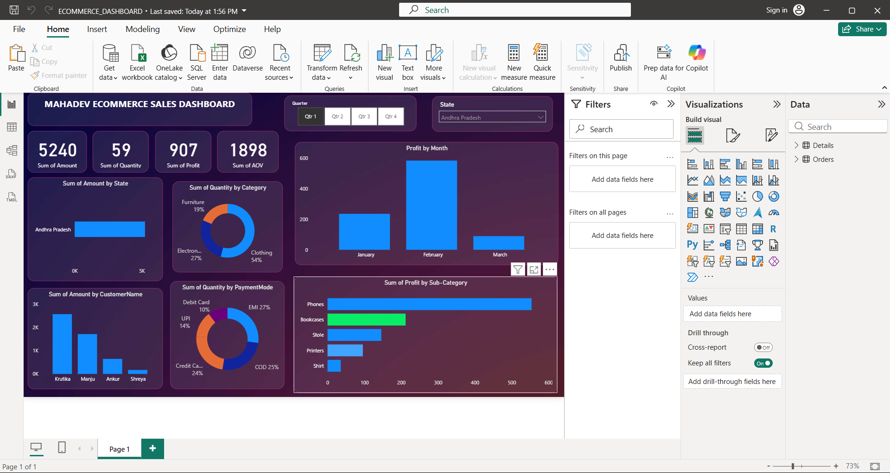

# 🛒 E-Commerce Sales Analysis | Power BI Dashboard



> OWNER OF MAHADEV STORE WANTS US TO HELP THEM CREATE A DASHBOARD TO TRACK AND ANALYZE THERE OVERALL SALES ACROSS INDIA.

---

## 📌 Project Overview

This project focuses on analyzing an E-Commerce sales dataset and transforming raw sales data into an interactive business intelligence dashboard using **Microsoft Power BI**.

The dashboard provides a clear view of key business KPIs and helps identify sales trends, profitable categories, high-performing customers, state-wise performance and payment preferences.

---

## 🎯 Project Objectives

- Analyze overall E-Commerce sales performance
- Track total sales, quantity and profit
- Analyze monthly and quarterly sales trends
- Identify top-performing states
- Analyze category and sub-category performance
- Understand customer-wise sales contribution
- Analyze payment method distribution
- Build an interactive and user-friendly Power BI dashboard
- Generate meaningful business insights from raw data

---

## 🛠️ Tools & Technologies

- **Power BI**
- **Power Query**
- **DAX**
- **Microsoft Excel / CSV**
- **Data Cleaning & Transformation**
- **Data Visualization**
- **Business Intelligence**

---

## 🔄 Project Workflow

```text
Raw E-Commerce Data
        ↓
Data Cleaning & Transformation
        ↓
Power Query
        ↓
Data Modeling
        ↓
DAX Measures
        ↓
Interactive Visualizations
        ↓
Power BI Dashboard
        ↓
Business Insights
